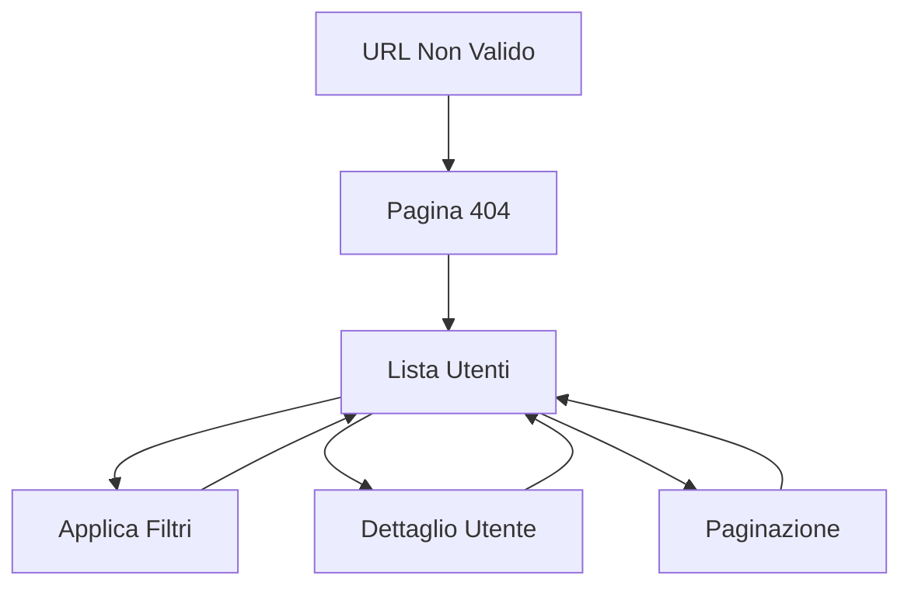

# Documentazione Requisiti Prodotto - Applicazione Gestione Utenti

## 1. Panoramica del Prodotto

Applicazione React con TypeScript per la gestione e visualizzazione di utenti, sviluppata come esercizio tecnico. L'app permette di visualizzare una lista di utenti con funzionalità di filtro avanzate e di consultare i dettagli completi di ogni utente.

L'applicazione utilizza le API DummyJSON per fornire dati di test realistici e dimostra competenze moderne di sviluppo frontend con React, TypeScript e strumenti di build avanzati.

## 2. Funzionalità Principali

### 2.1 Ruoli Utente

Non sono necessari ruoli distinti per questa applicazione, in quanto si tratta di un'interfaccia di sola lettura per la consultazione dei dati utente.

### 2.2 Moduli Funzionali

I requisiti dell'applicazione consistono nelle seguenti pagine principali:

1. **Pagina Lista Utenti**: navigazione principale, lista utenti paginata, filtri di ricerca
2. **Pagina Dettaglio Utente**: informazioni complete utente, navigazione di ritorno
3. **Pagina 404**: gestione errori di navigazione

### 2.3 Dettagli delle Pagine

| Nome Pagina | Nome Modulo | Descrizione Funzionalità |
|-------------|-------------|-------------------------|
| Lista Utenti | Header Navigation | Titolo applicazione, indicatori di stato caricamento |
| Lista Utenti | Filtri di Ricerca | Filtro per email (ricerca testuale), filtro per gender (dropdown), filtro per role (dropdown), reset filtri |
| Lista Utenti | Griglia Utenti | Visualizzazione card utenti con foto, nome, email, gender, role. Paginazione con controlli avanti/indietro. Click su card per navigare al dettaglio |
| Dettaglio Utente | Header Dettaglio | Nome completo utente, foto profilo, pulsante ritorno alla lista |
| Dettaglio Utente | Informazioni Personali | Nome, cognome, età, data nascita, gender, email, telefono |
| Dettaglio Utente | Informazioni Fisiche | Altezza, peso, gruppo sanguigno, colore occhi, colore e tipo capelli |
| Dettaglio Utente | Indirizzo | Indirizzo completo, città, stato, codice postale, coordinate geografiche |
| Dettaglio Utente | Informazioni Professionali | Università, azienda, dipartimento, titolo lavorativo, indirizzo ufficio |
| Dettaglio Utente | Informazioni Bancarie | Tipo carta, numero carta (mascherato), scadenza, valuta, IBAN |
| Pagina 404 | Errore Navigazione | Messaggio errore, link ritorno homepage |

## 3. Processo Principale

Flusso utente principale:
1. L'utente accede alla pagina lista utenti
2. Può applicare filtri per email, gender o role per restringere i risultati
3. Naviga tra le pagine utilizzando i controlli di paginazione
4. Clicca su una card utente per visualizzare i dettagli completi
5. Dalla pagina dettaglio può tornare alla lista mantenendo i filtri applicati

## 4. Design dell'Interfaccia Utente

### 4.1 Stile di Design

- **Colori primari**: Blu (#3B82F6) per elementi interattivi, Grigio scuro (#1F2937) per testi
- **Colori secondari**: Grigio chiaro (#F3F4F6) per sfondi, Verde (#10B981) per stati positivi
- **Stile pulsanti**: Arrotondati con ombre sottili, effetti hover con transizioni fluide
- **Font**: Inter o system font, dimensioni 14px-16px per testo normale, 24px-32px per titoli
- **Layout**: Design a card con spaziature generose, layout responsive con griglia CSS
- **Icone**: Heroicons per coerenza con Tailwind CSS, stile outline per azioni secondarie

### 4.2 Panoramica Design Pagine

| Nome Pagina | Nome Modulo | Elementi UI |
|-------------|-------------|-------------|
| Lista Utenti | Header | Background gradiente blu, titolo centrato font-bold text-2xl, indicatore loading con spinner |
| Lista Utenti | Filtri | Container bianco con shadow, input search con icona, dropdown con stile custom, bottone reset rosso |
| Lista Utenti | Griglia | Grid responsive 1-3 colonne, card bianche con hover shadow, immagini circolari 64px, badge colorati per role |
| Lista Utenti | Paginazione | Bottoni numerici con stato attivo blu, frecce navigazione, info "X di Y risultati" |
| Dettaglio Utente | Header | Background gradiente, immagine profilo 128px, nome font-bold text-3xl, breadcrumb navigazione |
| Dettaglio Utente | Sezioni Info | Card separate per categoria, icone descrittive, layout a due colonne su desktop |
| Pagina 404 | Errore | Illustrazione SVG, messaggio centrato, bottone CTA blu per ritorno home |

### 4.3 Responsività

Applicazione mobile-first con breakpoint Tailwind CSS standard. Ottimizzazione touch per dispositivi mobili con target touch di almeno 44px per elementi interattivi. Layout adattivo che passa da singola colonna su mobile a layout multi-colonna su desktop.