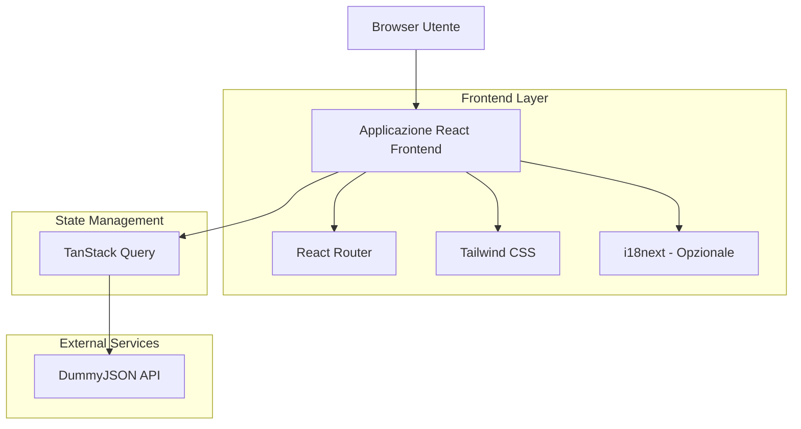
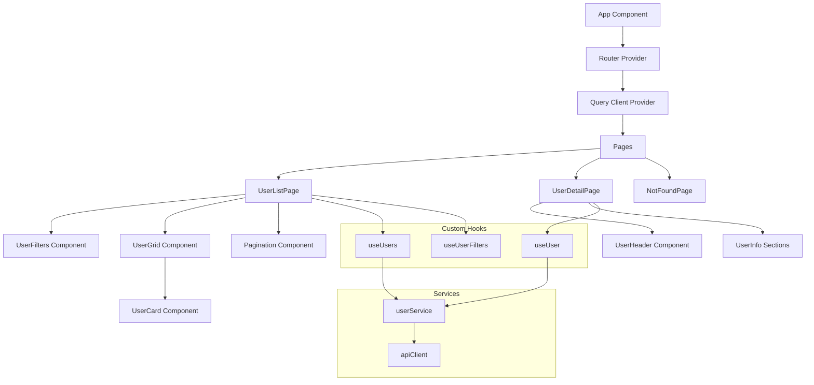

# Documentazione Architettura Tecnica - Applicazione Gestione Utenti

## 1. Design dell'Architettura



## 2. Descrizione Tecnologie

* Frontend: React\@18 + TypeScript\@5 + Vite\@5

* Styling: Tailwind CSS\@3

* Routing: React Router\@6

* State Management: TanStack Query\@5

* Internazionalizzazione: i18next\@23 (opzionale)

* Build Tool: Vite con plugin React e TypeScript

## 3. Definizioni Route

| Route      | Scopo                                         |
| ---------- | --------------------------------------------- |
| /          | Pagina home che reindirizza alla lista utenti |
| /users     | Lista utenti con filtri e paginazione         |
| /users/:id | Pagina dettaglio utente specifico             |
| /404       | Pagina errore per route non trovate           |
| /\*        | Catch-all che reindirizza a 404               |

## 4. Definizioni API

### 4.1 API Principali

**Recupero lista utenti**

```
GET https://dummyjson.com/users
```

Parametri Query:

| Nome Parametro | Tipo   | Richiesto | Descrizione                                           |
| -------------- | ------ | --------- | ----------------------------------------------------- |
| limit          | number | false     | Numero massimo utenti per pagina (default: 30)        |
| skip           | number | false     | Numero utenti da saltare per paginazione (default: 0) |
| select         | string | false     | Campi specifici da includere nella risposta           |

Risposta:

| Nome Campo | Tipo    | Descrizione                      |
| ---------- | ------- | -------------------------------- |
| users      | User\[] | Array di oggetti utente          |
| total      | number  | Numero totale utenti disponibili |
| skip       | number  | Numero utenti saltati            |
| limit      | number  | Limite utenti per pagina         |

**Recupero singolo utente**

```
GET https://dummyjson.com/users/{id}
```

Parametri Path:

| Nome Parametro | Tipo   | Richiesto | Descrizione            |
| -------------- | ------ | --------- | ---------------------- |
| id             | number | true      | ID univoco dell'utente |

Risposta: Oggetto User completo

**Ricerca utenti**

```
GET https://dummyjson.com/users/search
```

Parametri Query:

| Nome Parametro | Tipo   | Richiesto | Descrizione        |
| -------------- | ------ | --------- | ------------------ |
| q              | string | true      | Termine di ricerca |
| limit          | number | false     | Limite risultati   |
| skip           | number | false     | Offset paginazione |

### 4.2 Tipi TypeScript

```typescript
interface User {
  id: number;
  firstName: string;
  lastName: string;
  maidenName: string;
  age: number;
  gender: 'male' | 'female';
  email: string;
  phone: string;
  username: string;
  password: string;
  birthDate: string;
  image: string;
  bloodGroup: string;
  height: number;
  weight: number;
  eyeColor: string;
  hair: {
    color: string;
    type: string;
  };
  ip: string;
  address: {
    address: string;
    city: string;
    state: string;
    stateCode: string;
    postalCode: string;
    coordinates: {
      lat: number;
      lng: number;
    };
    country: string;
  };
  macAddress: string;
  university: string;
  bank: {
    cardExpire: string;
    cardNumber: string;
    cardType: string;
    currency: string;
    iban: string;
  };
  company: {
    department: string;
    name: string;
    title: string;
    address: {
      address: string;
      city: string;
      state: string;
      stateCode: string;
      postalCode: string;
      coordinates: {
        lat: number;
        lng: number;
      };
      country: string;
    };
  };
  ein: string;
  ssn: string;
  userAgent: string;
  crypto: {
    coin: string;
    wallet: string;
    network: string;
  };
  role: 'admin' | 'moderator' | 'user';
}

interface UsersResponse {
  users: User[];
  total: number;
  skip: number;
  limit: number;
}

interface UserFilters {
  email?: string;
  gender?: 'male' | 'female' | '';
  role?: 'admin' | 'moderator' | 'user' | '';
}

interface PaginationParams {
  page: number;
  limit: number;
}
```

## 5. Architettura Frontend



## 6. Struttura del Progetto

```
src/
├── components/           # Componenti riutilizzabili
│   ├── ui/              # Componenti UI base
│   ├── UserCard/        # Card utente per lista
│   ├── UserFilters/     # Filtri di ricerca
│   ├── Pagination/      # Controlli paginazione
│   └── Layout/          # Layout principale
├── pages/               # Pagine dell'applicazione
│   ├── UserListPage/    # Lista utenti
│   ├── UserDetailPage/  # Dettaglio utente
│   └── NotFoundPage/    # Pagina 404
├── hooks/               # Custom hooks
│   ├── useUsers.ts      # Hook per lista utenti
│   ├── useUser.ts       # Hook per singolo utente
│   └── useUserFilters.ts # Hook per gestione filtri
├── services/            # Servizi API
│   ├── userService.ts   # Servizio utenti
│   └── apiClient.ts     # Client HTTP base
├── types/               # Definizioni TypeScript
│   └── user.ts          # Tipi relativi agli utenti
├── utils/               # Utility functions
│   ├── formatters.ts    # Formattatori dati
│   └── constants.ts     # Costanti applicazione
├── i18n/                # Internazionalizzazione (opzionale)
│   ├── locales/         # File traduzioni
│   └── index.ts         # Configurazione i18n
└── App.tsx              # Componente principale
```

## 7. Configurazione Sviluppo

### 7.1 Dipendenze Principali

```json
{
  "dependencies": {
    "react": "^18.2.0",
    "react-dom": "^18.2.0",
    "react-router-dom": "^6.8.0",
    "@tanstack/react-query": "^5.0.0",
    "@tanstack/react-query-devtools": "^5.0.0"
  },
  "devDependencies": {
    "@types/react": "^18.2.0",
    "@types/react-dom": "^18.2.0",
    "@vitejs/plugin-react": "^4.0.0",
    "typescript": "^5.0.0",
    "vite": "^5.0.0",
    "tailwindcss": "^3.3.0",
    "autoprefixer": "^10.4.0",
    "postcss": "^8.4.0"
  }
}
```

### 7.2 Scripts di Sviluppo

```json
{
  "scripts": {
    "dev": "vite",
    "build": "tsc && vite build",
    "preview": "vite preview",
    "lint": "eslint src --ext ts,tsx",
    "type-check": "tsc --noEmit"
  }
}
```

### 7.3 Configurazione Vite

```typescript
// vite.config.ts
import { defineConfig } from 'vite'
import react from '@vitejs/plugin-react'
import path from 'path'

export default defineConfig({
  plugins: [react()],
  resolve: {
    alias: {
      '@': path.resolve(__dirname, './src'),
    },
  },
  server: {
    port: 3000,
    open: true
  }
})
```

